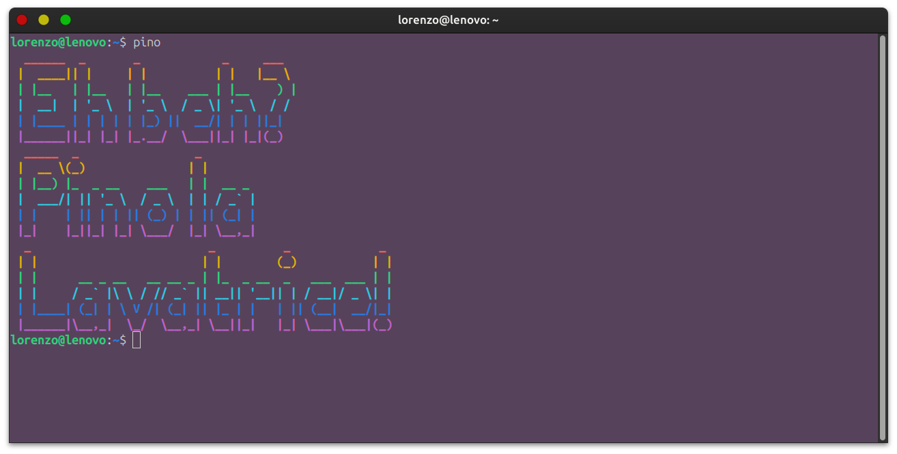
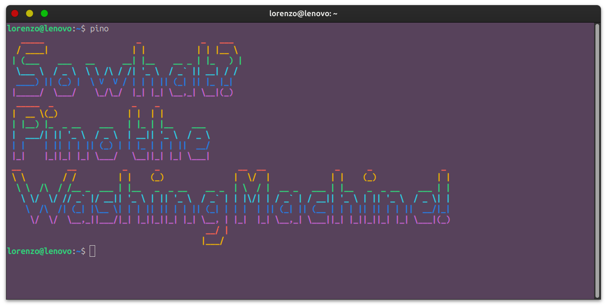

# 🌀 Pino the Washing Machine (Terminal Edition)

> **"So what? Pino the Washing Machine!"**  
~ Ancient Sardinian proverb

---

## 🧺 Who is Pino?

> Legend says that during a blackout in Cagliari, a washing machine started doing stand-up comedy. That was the day Pino was born.

**Pino the Washing Machine** (also known as *Pino la Lavatrice*) is not just an appliance.  
He’s a *philosopher*, a *comedian*, and the only Pino certified to perform in a Bash shell.

---

## 🔥 Features

* Randomized startup banner
* Works on **any Linux terminal** (yes, even yours)

---

## 💻 Installation

1. Clone the repository:

```bash
git clone https://github.com/diodoLedd/PinoTheWashingMachine.git
cd PinoTheWashingMachine
```

2. Start the automatic installation script:

```bash
bash install.sh
```

This script:

* Installs `pino` in `/usr/local/bin`.
* Makes the script executable.
* Adds `/usr/local/bin` to your `$PATH` if necessary.

> Restart the terminal

---

## 🧠 Usage

```bash
pino
```

You will be greeted by an ASCII rainbow randomly generated by Pine.

---

## 🗣 Example Output





---

## 🤝 Contributing

Do you want to add a new banner? Or have Pino insulted in ecclesiastical Latin?
Open a pull request. But remember:

**So what? Pino the Washing Machine**

---

## 📜 License

This project is licensed under the **Sardinian Comedy License v2.0**.
You may remix, reuse, recolor - but **never spin hot**.

---

## 🧼 Final Words

If you don't understand this project...
**E beh? Pino la Lavatrice!**
